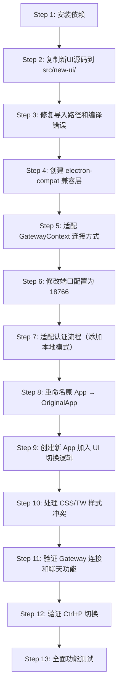

# ui-react-prod → ClawX 前端移植迁移计划

## 概述

将 `ai-desktop-sandbox/ui-react-prod`（以下简称 **新UI**）的前端移植到 `ClawX` 项目中，覆盖在 ClawX 的原有前端之上,作为默认 UI 界面。使用 `Ctrl+P` 快捷键在新旧前端之间切换。

---

## 1. 两个项目的架构对比分析

### 1.1 技术栈差异

| 特性 | ClawX（原UI） | ui-react-prod（新UI） |
|------|-------------|---------------------|
| **UI 框架** | React + Radix UI + shadcn/ui | React + Ant Design (antd v6) |
| **样式方案** | TailwindCSS v3 + CSS Modules | TailwindCSS v4 + Ant Design 主题 |
| **状态管理** | Zustand (stores/) | React Context + useState |
| **路由** | react-router-dom (BrowserRouter) | react-router-dom (HashRouter) |
| **Gateway 通信** | Electron IPC (`invokeIpc`) + 传输抽象层 | WebSocket 直连 (`GatewayBrowserClient`) |
| **认证方式** | Electron Settings Store (无独立登录) | 独立 AuthService (JWT Token + API) |
| **图表库** | 无 | Recharts |
| **终端模拟** | 无 | xterm.js |
| **Markdown** | react-markdown + remark-gfm | marked + DOMPurify |
| **打包工具** | Vite + vite-plugin-electron | 独立 Vite (纯 Web) |
| **构建产物** | Electron 桌面应用 | 静态 Web 页面 (dist/) |

### 1.2 通信架构差异

**ClawX（原UI）通信链路：**
```
React UI → invokeIpc() → Electron IPC → Main Process → Gateway/OpenClaw
         → WS Transport → Gateway WebSocket → OpenClaw
         → HTTP Transport → Gateway HTTP API → OpenClaw
```

**新UI 通信链路：**
```
React UI → GatewayBrowserClient → WebSocket 直连 → Gateway
         → AuthService → HTTP API → 后端认证服务
         → electronAPI (可选) → Electron IPC → 文件读取等
```

### 1.3 页面功能映射

| 新UI 页面 | ClawX 对应页面 | 说明 |
|-----------|-------------|------|
| `Home.tsx` | `Dashboard/` | 首页仪表盘 + 数字员工管理（创建/编辑/删除） |
| `DigitalEmployees.tsx` | `Chat/` | 聊天对话页面（核心功能） |
| `Chat.tsx` | `Chat/` | 简版聊天（OpenClaw 原始） |
| `Agents.tsx` | 无 | Agent 列表管理 |
| `Skills.tsx` | `Skills/` | 技能管理 |
| `Sessions.tsx` | （Sidebar 中） | 会话管理 |
| `Cron.tsx` | `Cron/` | 定时任务 |
| `Config.tsx` | `Settings/` | 配置管理 |
| `Shop.tsx` | 无 | 技能商店（新功能） |
| `Classroom.tsx` | 无 | 学习课堂（新功能） |
| `ComputePoints.tsx` | 无 | 算力积分（新功能） |
| `SystemSettings.tsx` | `Settings/` | 系统设置 |
| `Profile.tsx` | 无 | 用户资料页 |
| `CommandTerminal.tsx` | 无 | 命令行终端 |
| `Debug.tsx` | 无 | 调试器 |
| `Nodes.tsx` | 无 | 算力节点 |
| `Instances.tsx` | 无 | 运行实例 |
| `Usage.tsx` | 无 | 用量统计 |
| `LoginModal.tsx` | `Setup/` | 登录/注册弹窗 |

---

## 2. 迁移策略

### 2.1 总体方案：双 UI 并存 + 覆盖层切换

```
┌─────────────────────────────────────────────────────┐
│ Electron Window                                      │
│  ┌─────────────────────────────────────────────────┐ │
│  │              UI 切换控制层                        │ │
│  │      (Ctrl+P 切换 activeUI state)                │ │
│  │  ┌──────────────────┐  ┌──────────────────────┐ │ │
│  │  │   新 UI (默认)    │  │   原 ClawX UI        │ │ │
│  │  │  (antd Layout)    │  │  (MainLayout)         │ │ │
│  │  │  GatewayProvider  │  │  Zustand Stores       │ │ │
│  │  │  WebSocket 直连   │  │  IPC + Transport      │ │ │
│  │  └──────────────────┘  └──────────────────────┘ │ │
│  └─────────────────────────────────────────────────┘ │
│                OpenClaw Gateway (port 18766)          │
└─────────────────────────────────────────────────────┘
```

**核心思路：** 在 `App.tsx` 最顶层加入一个 `UISwitch` 组件，通过 state 控制渲染哪套 UI。

### 2.2 分阶段实施

#### 阶段一：集成新 UI 代码到 ClawX 仓库（约 2-3 天）
#### 阶段二：适配通信层（约 2-3 天）
#### 阶段三：实现 UI 切换机制（约 1 天）
#### 阶段四：打磨和测试（约 1-2 天）

---

## 3. 详细实施步骤

### 阶段一：集成新 UI 代码到 ClawX 仓库

#### 步骤 1.1：安装新 UI 的额外依赖

在 ClawX 的 `package.json` 中添加新UI独有的依赖：

```bash
# Ant Design 及图标
pnpm add antd @ant-design/icons

# 图表库
pnpm add recharts

# xterm.js 终端模拟
pnpm add xterm xterm-addon-fit xterm-addon-web-links

# 工具库
pnpm add dayjs dompurify marked

# 类型
pnpm add -D @types/dompurify @types/marked
```

> **注意：** `react`, `react-dom`, `react-router-dom` 两个项目版本接近，无需重复安装。

#### 步骤 1.2：创建新 UI 目录结构

在 `src/` 下创建隔离的新 UI 目录：

```
src/
├── App.tsx                    # 修改：加入 UI 切换逻辑
├── main.tsx                   # 保持不变
├── new-ui/                    # ★ 新 UI 独立目录
│   ├── App.tsx                # 新 UI 的入口布局 (从 ui-react-prod/App.tsx 迁移)
│   ├── constants.tsx           # 常量
│   ├── types.ts               # 类型定义
│   ├── core/                  # 核心模块
│   │   ├── GatewayContext.tsx  # Gateway WebSocket 上下文
│   │   ├── gateway.ts          # WebSocket 客户端
│   │   ├── auth.ts             # 认证服务
│   │   ├── chat-utils.ts       # 聊天工具函数
│   │   ├── device-auth.ts      # 设备认证
│   │   ├── device-identity.ts  # 设备身份
│   │   ├── storage.ts          # 本地存储
│   │   ├── types.ts            # 核心类型
│   │   └── uuid.ts             # UUID 生成
│   ├── libs/                  # 工具库
│   │   ├── chat-envelope.ts
│   │   ├── client-info.ts
│   │   ├── connect-error-details.ts
│   │   ├── control-ui-contract.ts
│   │   ├── device-auth.ts
│   │   ├── events.ts
│   │   ├── format-duration.ts
│   │   ├── format-time/
│   │   ├── sessions/
│   │   ├── strip-inbound-meta.ts
│   │   ├── text/
│   │   ├── tool-catalog.ts
│   │   ├── tool-display-common.ts
│   │   ├── tool-policy-shared.ts
│   │   └── usage-aggregates.ts
│   ├── components/            # 组件
│   │   ├── LoginModal.tsx
│   │   ├── LogoIcon.tsx
│   │   ├── SearchSessionsModal.tsx
│   │   └── login.css
│   ├── pages/                 # 页面
│   │   ├── Home.tsx
│   │   ├── DigitalEmployees.tsx
│   │   ├── Chat.tsx
│   │   ├── Agents.tsx
│   │   ├── Skills.tsx
│   │   ├── Sessions.tsx
│   │   ├── Config.tsx
│   │   ├── Cron.tsx
│   │   ├── Usage.tsx
│   │   ├── Instances.tsx
│   │   ├── Debug.tsx
│   │   ├── ComputePoints.tsx
│   │   ├── Shop.tsx
│   │   ├── Classroom.tsx
│   │   ├── SystemSettings.tsx
│   │   ├── Profile.tsx
│   │   ├── CommandTerminal.tsx
│   │   └── Nodes.tsx
│   └── styles/                # 样式
│       ├── App.css
│       └── index.css
├── components/                # 原 ClawX 组件（保留）
├── pages/                     # 原 ClawX 页面（保留）
├── stores/                    # 原 ClawX 状态管理（保留）
└── lib/                       # 原 ClawX 工具库（保留）
```

#### 步骤 1.3：复制并适配源码

将 `ui-react-prod/src/` 下的文件复制到 `src/new-ui/` 并修改导入路径：

**需要修改的导入路径示例：**

```typescript
// 修改前 (ui-react-prod)
import { GatewayProvider, useGateway } from './core/GatewayContext';
import Home from './pages/Home';

// 修改后 (ClawX 中)
import { GatewayProvider, useGateway } from '@/new-ui/core/GatewayContext';
import Home from '@/new-ui/pages/Home';
```

---

### 阶段二：适配通信层

#### 步骤 2.1：适配 GatewayContext 连接方式

新 UI 的 `GatewayContext.tsx` 需要适配 ClawX 的 Electron 环境：

**关键修改点：**

1. **Gateway URL 和 Token 获取**：新 UI 通过 `electronAPI.readGatewayConfig()` 或 `localStorage` 获取连接配置。在 ClawX 中需要改为从 ClawX 的 Electron IPC 获取：

```typescript
// src/new-ui/core/GatewayContext.tsx 中修改 connect 方法
const connect = async (url: string, password?: string, token?: string) => {
    // 从 ClawX 的 IPC 获取 Gateway 状态
    try {
        const status = await window.electron.ipcRenderer.invoke('gateway:status');
        if (status?.port && status?.token) {
            url = url || `ws://127.0.0.1:${status.port}`;
            token = token || status.token;
        }
    } catch (e) {
        console.warn('[NewUI Gateway] Failed to get gateway status via IPC:', e);
    }
    
    // 回退到直接从 openclaw.json 读取
    if (!url || !token) {
        try {
            const config = await window.electron.ipcRenderer.invoke('gateway:rpc', 'config.get');
            // ... 处理配置
        } catch (e) {
            // 回退到默认值
            url = url || 'ws://127.0.0.1:18766';
        }
    }
    
    // ... 继续原有连接逻辑
};
```

2. **自动连接**：利用 ClawX 的 Gateway 状态事件监听自动触发连接：

```typescript
// 监听 ClawX Gateway 状态变化
useEffect(() => {
    const unsub = window.electron.ipcRenderer.on('gateway:status-changed', (status: any) => {
        if (status?.state === 'running' && !connected) {
            connect(''); // 自动重连
        }
    });
    return unsub;
}, [connected]);
```

#### 步骤 2.2：适配 `electronAPI` 引用

新 UI 中使用 `(window as any).electronAPI` 访问 Electron API，而 ClawX 使用 `window.electron`。需要统一：

```typescript
// 方案 A：在新 UI 代码中创建兼容层
// src/new-ui/core/electron-compat.ts
export const electronBridge = {
    readGatewayConfig: async () => {
        try {
            const status = await window.electron.ipcRenderer.invoke('gateway:status');
            const token = await window.electron.ipcRenderer.invoke('settings:get', 'gatewayToken');
            return { port: status?.port || 18766, token };
        } catch {
            return null;
        }
    },
    send: (channel: string, data: any) => {
        // 映射到 ClawX IPC
        window.electron.ipcRenderer.invoke(channel, data);
    }
};
```

#### 步骤 2.3：适配认证流程

新 UI 有独立的 `AuthService`（连接外部 API `ai-api.fantasy-lab.com`），在 ClawX 中需要决定：

**方案 A（推荐）：保留独立认证 + 跳过选项**
- 保留 `LoginModal`，但增加"本地模式"按钮，跳过远程认证直接连接本地 Gateway
- 已登录状态存储在 `localStorage`

**方案 B：完全集成到 ClawX 设置流程**
- 将认证信息整合到 ClawX 的 Setup Wizard 中
- 使用 Electron Store 持久化

```typescript
// 方案 A 示例修改
// src/new-ui/components/LoginModal.tsx
// 增加 "本地模式" 按钮
<Button onClick={() => {
    AuthService.setToken('local-mode');
    AuthService.setUser({ user_id: 'local', username: '本地用户', org_id: 'local' });
    onLoginSuccess();
}}>
    本地模式（跳过登录）
</Button>
```

#### 步骤 2.4：适配 storage.ts 端口配置

新 UI 的 `storage.ts` 默认 Gateway URL 是 `ws://127.0.0.1:18789`，需修改为 ClawX 的端口：

```typescript
// src/new-ui/core/storage.ts
const defaultUrl = "ws://127.0.0.1:18766"; // 改为 ClawX 配置的端口
```

---

### 阶段三：实现 UI 切换机制

#### 步骤 3.1：修改根 App.tsx

```typescript
// src/App.tsx
import { useState, useEffect } from 'react';
import OriginalApp from './OriginalApp'; // 重命名原来的 App 组件
import NewUIApp from './new-ui/App';

function App() {
    // 默认显示新 UI
    const [activeUI, setActiveUI] = useState<'new' | 'original'>('new');

    // Ctrl+P 快捷键切换
    useEffect(() => {
        const handleKeyDown = (e: KeyboardEvent) => {
            if ((e.ctrlKey || e.metaKey) && e.key === 'p') {
                e.preventDefault();
                setActiveUI(prev => prev === 'new' ? 'original' : 'new');
            }
        };
        window.addEventListener('keydown', handleKeyDown);
        return () => window.removeEventListener('keydown', handleKeyDown);
    }, []);

    return (
        <>
            {/* 切换指示器 */}
            <div style={{
                position: 'fixed',
                bottom: 8,
                left: '50%',
                transform: 'translateX(-50%)',
                zIndex: 99999,
                padding: '4px 12px',
                borderRadius: '12px',
                background: 'rgba(0,0,0,0.6)',
                color: '#fff',
                fontSize: '11px',
                pointerEvents: 'none',
                opacity: 0.5,
            }}>
                Ctrl+P 切换 UI | 当前: {activeUI === 'new' ? '新版' : '经典版'}
            </div>
            
            {/* UI 渲染 */}
            <div style={{ display: activeUI === 'new' ? 'block' : 'none', height: '100vh' }}>
                <NewUIApp />
            </div>
            <div style={{ display: activeUI === 'original' ? 'block' : 'none', height: '100vh' }}>
                <OriginalApp />
            </div>
        </>
    );
}

export default App;
```

> **注意：** 使用 `display: none` 而不是条件渲染，避免切换时丢失组件状态。

#### 步骤 3.2：重构原 App 为子组件

将原来的 `src/App.tsx` 重命名为 `src/OriginalApp.tsx`，保持其所有路由和逻辑不变。

#### 步骤 3.3：适配新 UI 入口

新 UI 的 `App.tsx` 使用 `HashRouter`，但 ClawX 原 UI 使用 `BrowserRouter`。需要处理路由冲突：

```typescript
// src/new-ui/App.tsx
// 注意：不在这里包裹 HashRouter，因为外层已经有 BrowserRouter
// 改为使用 MemoryRouter 或内部自定路由

import { MemoryRouter } from 'react-router-dom';

export default function NewUIApp() {
    return (
        <MemoryRouter>
            <GatewayProvider>
                <MainLayout />
            </GatewayProvider>
        </MemoryRouter>
    );
}
```

---

### 阶段四：打磨和测试

#### 步骤 4.1：样式隔离

两套 UI 的全局样式可能冲突，需要做样式隔离：

```css
/* 方案 1：使用 CSS 作用域 */
.new-ui-root {
    /* 新 UI 的全局样式重置 */
    all: initial;
    font-family: 'Noto Sans SC', -apple-system, BlinkMacSystemFont, sans-serif;
}

/* 方案 2：使用 CSS Modules 或 CSS-in-JS 避免全局冲突 */
```

**Tailwind 版本冲突处理：**
- ClawX 使用 TailwindCSS v3（PostCSS 插件模式）
- 新 UI 使用 TailwindCSS v4（Vite 插件模式 `@tailwindcss/vite`）
- **建议：** 新 UI 迁移后统一使用 ClawX 的 TailwindCSS v3 配置，或将新 UI 中 Tailwind 相关样式转为纯 CSS / Ant Design 主题配置

#### 步骤 4.2：Electron 窗口标题栏适配

新 UI 有自己的标题栏拖拽区域（`WebkitAppRegion: 'drag'`），需要与 ClawX 的 `TitleBar` 组件协调：

```typescript
// 新 UI 中如果显示，隐藏 ClawX 的 TitleBar
// 或者设置新 UI 的 Header 也支持拖拽
```

#### 步骤 4.3：功能验证清单

| 功能 | 验证项 | 优先级 |
|------|--------|--------|
| Gateway 连接 | 新 UI 能否成功连接到 OpenClaw Gateway | P0 |
| 聊天功能 | DigitalEmployees 页面发送消息和接收流式回复 | P0 |
| 会话管理 | 创建/切换/删除会话 | P0 |
| Agent 管理 | 创建/编辑/删除数字员工 | P1 |
| 文件上传 | 聊天中附件上传功能 | P1 |
| 主题切换 | 暗色/亮色主题切换一致 | P1 |
| 认证流程 | 登录/注册/本地模式 | P1 |
| Ctrl+P 切换 | 快捷键在两套 UI 间无缝切换 | P0 |
| 技能管理 | Skills 页面正常显示 | P2 |
| 定时任务 | Cron 页面正常工作 | P2 |
| 命令行终端 | xterm 终端功能 | P2 |
| 商店/课堂 | 新功能页面正常显示 | P3 |

---

## 4. 关键风险和注意事项

### 4.1 高风险项

1. **TailwindCSS 版本冲突**
   - ClawX TW v3 与新UI TW v4 不兼容，class 语法和配置方式差异较大
   - **解决方案：** 新 UI 移植后改用 Ant Design 内联样式 + ClawX 的 TW v3 配置

2. **双 Router 冲突**
   - 不能嵌套两个 `BrowserRouter`/`HashRouter`
   - **解决方案：** 新 UI 使用 `MemoryRouter` 独立管理路由

3. **Gateway 连接竞争**
   - 两套 UI 都可能尝试连接 Gateway，导致连接数过多
   - **解决方案：** 共享 Gateway 连接或确保只有当前活跃 UI 建立连接

4. **打包体积增大**
   - antd + recharts + xterm 增加约 2-3MB 的依赖
   - **评估：** 对 Electron 桌面应用影响可接受

### 4.2 中风险项

1. **CSS 命名冲突**
   - 两套 UI 的全局 CSS（`.App`, `body` 样式等）可能互相影响
   - **解决方案：** 使用 CSS 嵌套作用域 `.new-ui-root` 包裹

2. **WebSocket 端口不一致**
   - 新 UI 默认 `18789` vs ClawX 已改为 `18766`
   - **解决方案：** 统一修改新 UI storage.ts 默认端口

3. **外部 API 依赖**
   - 新 UI 的认证依赖 `ai-api.fantasy-lab.com`
   - **解决方案：** 增加本地模式跳过远程认证

### 4.3 低风险项

1. 新 UI 的 Mock 数据 (`constants.tsx`) 可按需保留或移除
2. 新 UI 的 `LogoIcon` 等品牌元素需替换为 ClawX 品牌
3. i18n 支持：新 UI 目前仅中文，ClawX 支持中英日三语

---

## 5. 文件修改清单

### 需要修改的 ClawX 现有文件

| 文件 | 修改内容 |
|------|---------|
| `package.json` | 添加 antd, recharts, xterm 等依赖 |
| `src/App.tsx` → `src/OriginalApp.tsx` | 重命名 |
| `src/App.tsx`（新建） | UI 切换逻辑 |
| `src/main.tsx` | 需确认是否需要调整 |
| `tailwind.config.js` | 添加 `new-ui/` 到 content 扫描路径 |
| `vite.config.ts` | 确认路径别名 `@/new-ui` 可用 |
| `index.html` | 可能需要添加 antd CSS 引用 |
| `tsconfig.json` | 如有路径映射需要添加 |

### 需要新建的文件（从 ui-react-prod 移植）

| 源文件 (ui-react-prod/src/) | 目标文件 (ClawX/src/new-ui/) |
|----------------------------|---------------------------|
| `App.tsx` | `App.tsx` |
| `App.css` | `styles/App.css` |
| `index.css` | `styles/index.css` |
| `constants.tsx` | `constants.tsx` |
| `types.ts` | `types.ts` |
| `core/*` (9个文件) | `core/*` |
| `libs/*` (15个文件+3个目录) | `libs/*` |
| `components/*` (4个文件) | `components/*` |
| `pages/*` (18个文件) | `pages/*` |
| `types/*` (2个文件) | `types/*` |

### 需要新建的适配文件

| 文件 | 用途 |
|------|-----|
| `src/new-ui/core/electron-compat.ts` | Electron API 兼容层 |
| `src/new-ui/core/gateway-adapter.ts` | Gateway 连接适配器 |

---

## 6. 推荐实施顺序



---

## 7. 预估工作量

| 阶段 | 任务 | 预估时间 |
|------|------|---------|
| 阶段一 | 安装依赖 + 复制源码 + 修复编译 | 2-3 天 |
| 阶段二 | 通信层适配 (Gateway + Auth + electronAPI) | 2-3 天 |
| 阶段三 | UI 切换机制实现 | 1 天 |
| 阶段四 | 样式隔离 + 测试 + 品牌替换 | 1-2 天 |
| **合计** | | **6-9 天** |

---

## 修改历史

| 日期 | 版本 | 修改内容 |
|------|------|---------|
| 2026-03-08 | 1.0 | 初始版本：完整迁移计划 |
